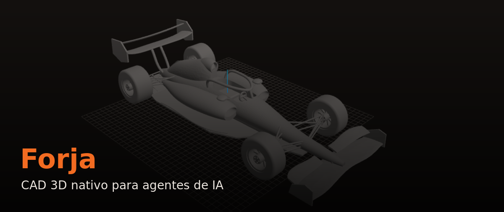
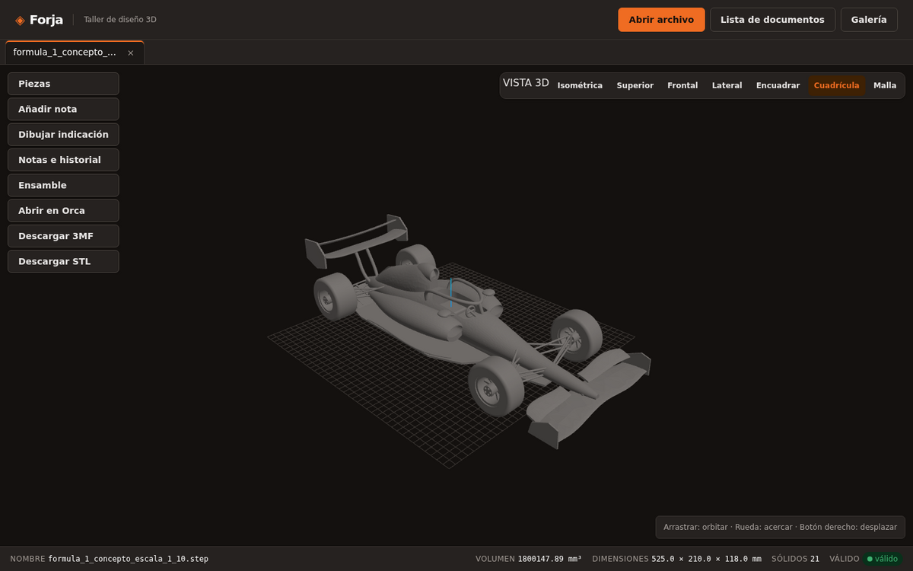
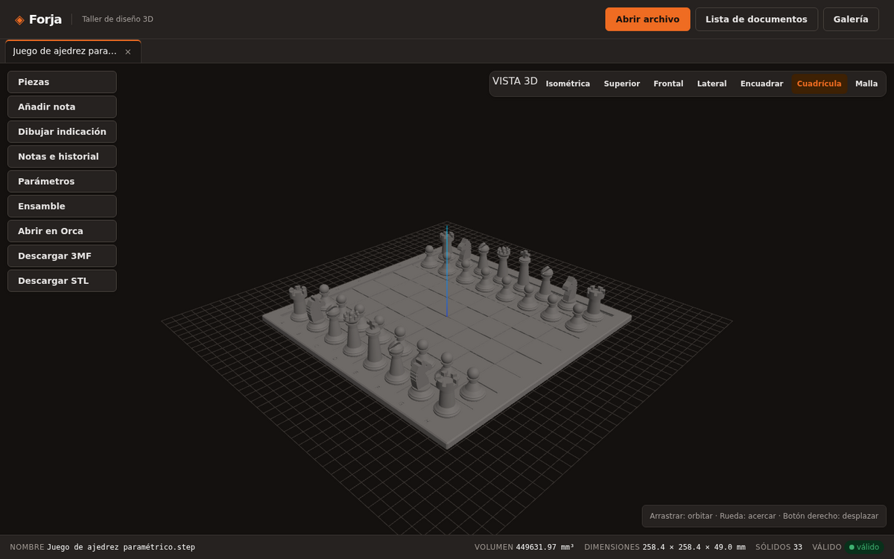
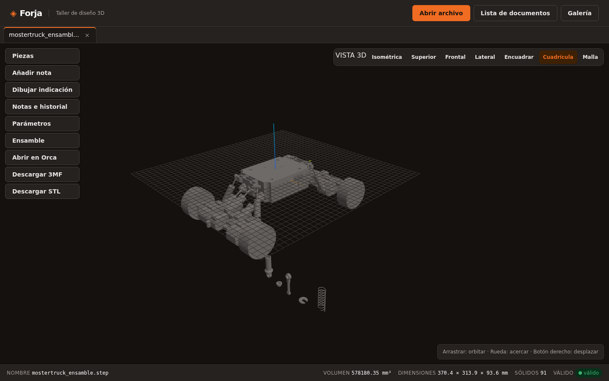
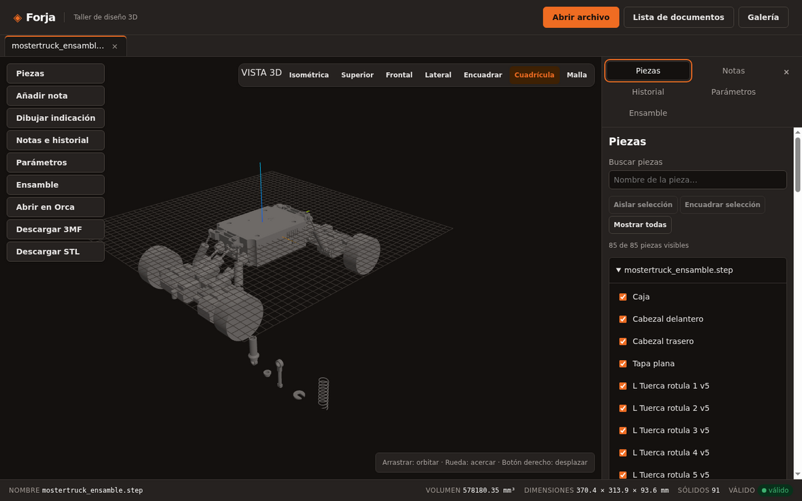
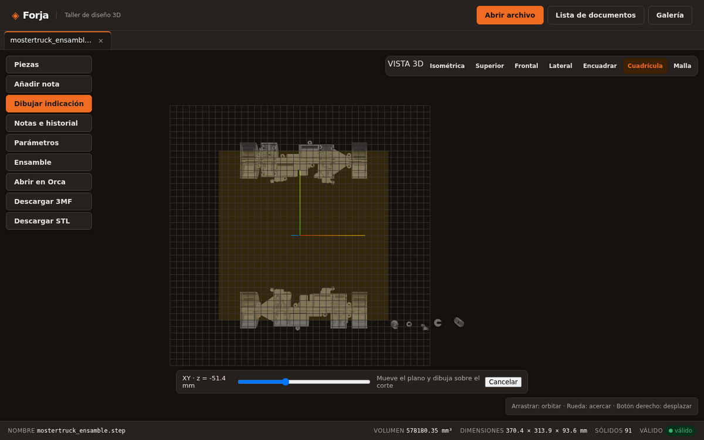
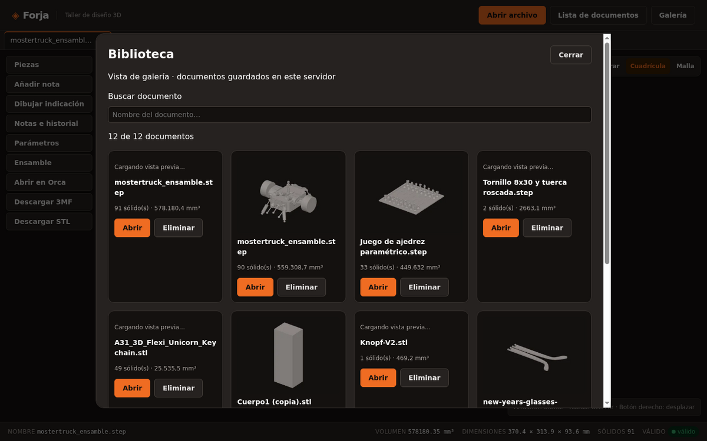
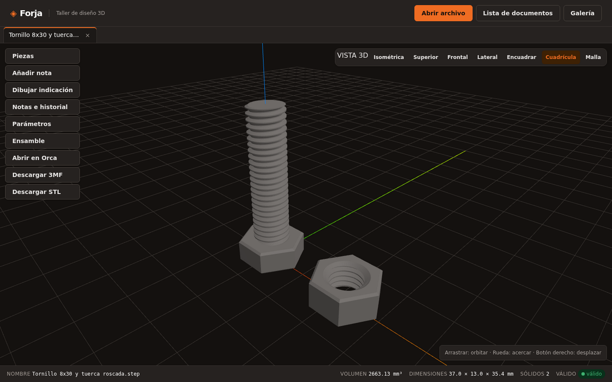
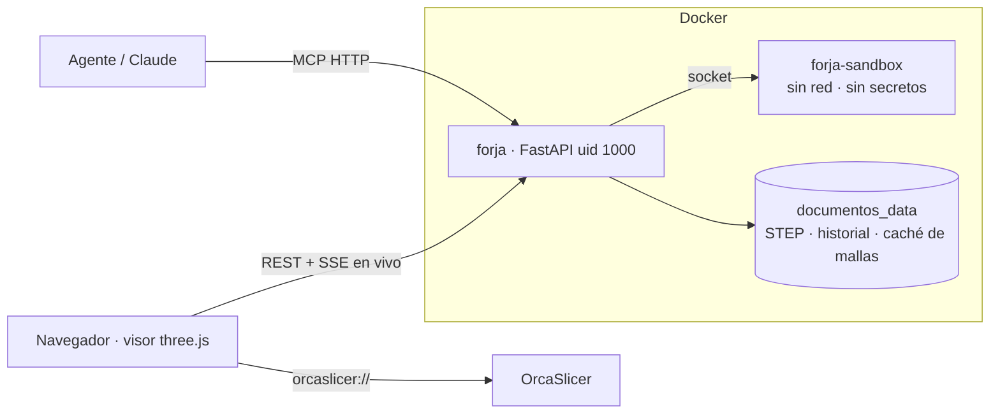
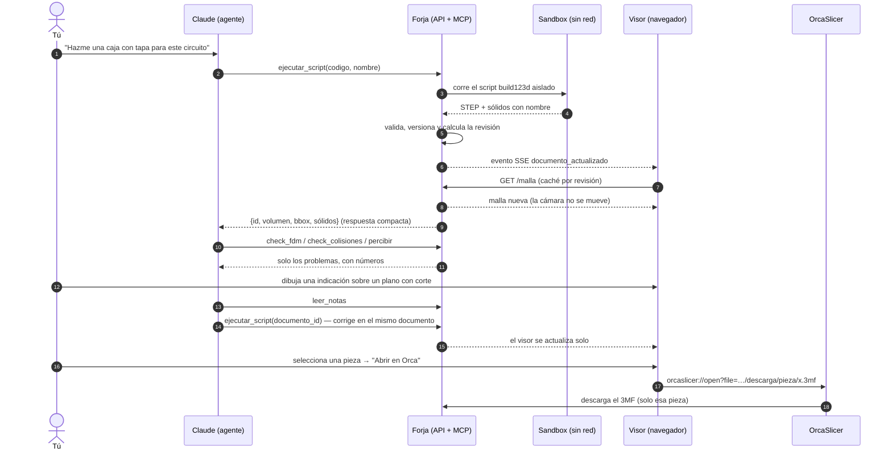

# 🔥 Forja — CAD 3D nativo para agentes de IA



[](LICENSE)
[](https://www.python.org/)
[](https://github.com/gumyr/build123d)
[](https://modelcontextprotocol.io/)
[](https://www.docker.com/)
[](https://threejs.org/)

[](https://github.com/sponsors/elisaul77)
[](https://paypal.me/eflorezp)
[](https://buymeacoffee.com/elisaul77)

**Forja es un taller de diseño 3D pensado para que un agente de IA (Claude, por MCP) diseñe contigo.** El agente escribe la pieza en Python con [build123d](https://github.com/gumyr/build123d), Forja la construye con un kernel CAD real (OpenCascade), la verifica y la muestra **en vivo** en el navegador. Tú la ves, la marcas, dibujas indicaciones encima y la mandas a imprimir en OrcaSlicer con un clic.

> Nada de mallas aproximadas ni "text-to-3D": geometría B-rep exacta, sólidos con nombre, historial de versiones y verificaciones medibles — en un solo contenedor Docker.

---

## ✨ Qué puedes hacer

- 🤖 **Diseñar hablando con Claude** — el agente crea y modifica piezas paramétricas por MCP (20 herramientas, respuestas compactas para gastar pocos tokens).
- 👀 **Ver el diseño en vivo** — cuando el agente cambia un documento, el visor se actualiza solo, sin recargar y sin mover tu cámara.
- 🧩 **Ensambles con piezas con nombre** — árbol de piezas, aislar, encuadrar; articulaciones `fijo` / `giro` / `deslizamiento` con poses por números.
- ✏️ **Indicarle al agente qué cambiar** — notas y pizarra sobre la geometría: dibuja sobre lo que ves, sobre una cara o sobre un **plano XY/XZ/YZ movible con corte en vivo**.
- 🔍 **Verificar antes de imprimir** — colisiones y holguras, imprimibilidad FDM (voladizos, paredes finas, cama), percepción espacial en texto (`percibir`).
- 🖨️ **Abrir en OrcaSlicer con un clic** — como en Printables: 3MF en mm con un objeto por pieza; con una pieza seleccionada, solo esa pieza.
- 🕓 **Historial y deshacer** — cada cambio aceptado es una versión restaurable; las notas siguen a sus caras entre reconstrucciones.
- 🛡️ **Ejecución aislada** — los scripts corren en un contenedor sandbox sin red, sin secretos y sin acceso a tus documentos.

## 📸 Capturas

| Diseño de un agente (F1 a escala 1:10) | Juego de ajedrez paramétrico |
|:---:|:---:|
|  |  |

| Ensamble de 91 piezas con nombre | Árbol de piezas |
|:---:|:---:|
|  |  |

| Pizarra sobre plano con corte en vivo | Galería de documentos |
|:---:|:---:|
|  |  |

| Tornillo M8 con rosca real y tuerca |
|:---:|
|  |

## 🚀 Inicio rápido

```bash
git clone https://github.com/elisaul77/forja.git
cd forja
cp .env.example .env          # opcional: carpeta de modelos en solo lectura
docker compose up -d --build
```

Abre **http://localhost:8710**.

### Conectar Claude Code (MCP por HTTP)

Forja genera un token al primer arranque y lo guarda como secreto del contenedor. Regístralo **una sola vez** en Claude Code (cabecera `X-Forja-Token`) apuntando a `http://localhost:8710/mcp`. Nunca lo pegues en chats ni lo pases por la línea de comandos.

## 🧠 Cómo trabaja el agente

```python
# El agente envía un script build123d con ejecutar_script(...)
from build123d import *

caja  = Box(60, 40, 30)
hueco = Cylinder(10, 40)

resultado = {                      # sólidos con nombre
    "cuerpo": caja - hueco,
}
```

1. **`ejecutar_script`** construye la pieza en el sandbox (para editar, pasa `documento_id` o reutiliza el mismo `nombre`).
2. **`percibir`** / **`check_colisiones`** / **`check_fdm`** devuelven números, no imágenes.
3. Tú lo ves en vivo, dejas notas o dibujas indicaciones; el agente las lee con **`leer_notas`**.
4. **`exportar`** devuelve el enlace para **abrir en OrcaSlicer**.

## 🏗️ Arquitectura



Stack: Python 3.12, build123d, cadquery-ocp (OpenCascade), manifold3d, python-fcl, trimesh, FastAPI, three.js (vendorizado), MCP. Decisiones de diseño en [`docs/decisions/`](docs/decisions/).

## 🔁 Flujo: del pedido a la impresora



## 🔬 Estado del arte (referencias)

Forja se diseñó después de revisar la investigación reciente sobre LLM → CAD. La conclusión que más pesó: **las mejoras grandes vienen del bucle de verificación (números del kernel + vistas), no de un modelo más grande**; y preguntar antes de dibujar reduce mucho los errores. Por eso Forja prioriza respuestas medibles (`percibir`, checks) y el canal de notas/pizarra.

| # | Trabajo | Año | DOI |
|---:|---|:---:|---|
| 1 | Query2CAD: Generating CAD models using natural language queries | 2024 | [10.48550/arXiv.2406.00144](https://doi.org/10.48550/arXiv.2406.00144) |
| 2 | Text2CAD: Generating Sequential CAD Models from Beginner-to-Expert Level Text Prompts (NeurIPS 2024) | 2024 | [10.48550/arXiv.2409.17106](https://doi.org/10.48550/arXiv.2409.17106) |
| 3 | Generating CAD Code with Vision-Language Models for 3D Designs — CADCodeVerify (ICLR 2025) | 2024 | [10.48550/arXiv.2410.05340](https://doi.org/10.48550/arXiv.2410.05340) |
| 4 | CAD-Recode: Reverse Engineering CAD Code from Point Clouds (ICCV 2025) | 2024 | [10.48550/arXiv.2412.14042](https://doi.org/10.48550/arXiv.2412.14042) |
| 5 | BlenderLLM: Training Large Language Models for Computer-Aided Design with Self-improvement | 2024 | [10.48550/arXiv.2412.14203](https://doi.org/10.48550/arXiv.2412.14203) |
| 6 | CAD-Coder: Text-to-CAD Generation with Chain-of-Thought and Geometric Reward | 2025 | [10.48550/arXiv.2505.19713](https://doi.org/10.48550/arXiv.2505.19713) |
| 7 | CADmium: Fine-Tuning Code Language Models for Text-Driven Sequential CAD Design | 2025 | [10.48550/arXiv.2507.09792](https://doi.org/10.48550/arXiv.2507.09792) |
| 8 | CADDesigner: Conceptual CAD Model Generation with a General-Purpose Agent | 2025 | [10.48550/arXiv.2508.01031](https://doi.org/10.48550/arXiv.2508.01031) |
| 9 | EvoCAD: Evolutionary CAD Code Generation with Vision Language Models | 2025 | [10.48550/arXiv.2510.11631](https://doi.org/10.48550/arXiv.2510.11631) |
| 10 | Clarify Before You Draw: Proactive Agents for Robust Text-to-CAD Generation (ProCAD) | 2026 | [10.48550/arXiv.2602.03045](https://doi.org/10.48550/arXiv.2602.03045) |
| 11 | CADSmith: Multi-Agent CAD Generation with Programmatic Geometric Validation | 2026 | [10.48550/arXiv.2603.26512](https://doi.org/10.48550/arXiv.2603.26512) |
| 12 | Agent-Aided Design for Dynamic CAD Models (AADvark) | 2026 | [10.48550/arXiv.2604.15184](https://doi.org/10.48550/arXiv.2604.15184) |
| 13 | Zero-to-CAD: Agentic Synthesis of Interpretable CAD Programs at Million-Scale Without Real Data | 2026 | [10.48550/arXiv.2604.24479](https://doi.org/10.48550/arXiv.2604.24479) |
| 14 | Self-Improving CAD Generation Agents with Finite Element Analysis as Feedback | 2026 | [10.48550/arXiv.2605.17448](https://doi.org/10.48550/arXiv.2605.17448) |
| 15 | Text2CAD-Bench: A Benchmark for LLM-based Text-to-Parametric CAD Generation | 2026 | [10.48550/arXiv.2605.18430](https://doi.org/10.48550/arXiv.2605.18430) |
| 16 | Embodied CAD: Solver-Grounded LLM Agents for Parametric B-Rep Assembly Modeling | 2026 | [10.48550/arXiv.2606.31252](https://doi.org/10.48550/arXiv.2606.31252) |
| 17 | MultiView-Bench: A Diagnostic Benchmark for World-Centric Multi-View Integration in VLMs | 2026 | [10.48550/arXiv.2607.08970](https://doi.org/10.48550/arXiv.2607.08970) |
| 18 | CADENA: Stepwise CAD Reverse Engineering | 2026 | [10.48550/arXiv.2608.00799](https://doi.org/10.48550/arXiv.2608.00799) |
| 19 | RA-CAD: Learning Post-Execution Critique for State-Aware Text-to-CAD Generation | 2026 | [10.48550/arXiv.2608.05714](https://doi.org/10.48550/arXiv.2608.05714) |
| 20 | Procedura: Agentic 3D Modeling with Procedural Control | 2026 | [10.48550/arXiv.2608.26238](https://doi.org/10.48550/arXiv.2608.26238) |
| 21 | MIRAGE-CAD: Construction-Mediated Multimodal Generation of Executable CAD Programs | 2026 | [10.48550/arXiv.2608.28669](https://doi.org/10.48550/arXiv.2608.28669) |
| 22 | Vision2CAD: A Visual Agent Harness for Explicit Geometry Referencing and Localization in Parametric CAD | 2026 | [10.48550/arXiv.2609.22688](https://doi.org/10.48550/arXiv.2609.22688) |

Productos revisados: Zoo / KittyCAD (Text-to-CAD, KCL), Adam / CADAM, Onshape, Autodesk Fusion, SolidWorks, Shapr3D, nTop, build123d-mcp y los MCP de OpenSCAD, FreeCAD y Blender.

## ❤️ Apoya el proyecto

Si Forja te sirve, puedes apoyar su desarrollo:

- ⭐ Dale una estrella al repo
- 💖 [GitHub Sponsors](https://github.com/sponsors/elisaul77)
- ☕ [Buy Me A Coffee](https://buymeacoffee.com/elisaul77)
- 💸 [PayPal](https://paypal.me/eflorezp)

---

## 📚 Referencia técnica

### Árbol de piezas

Abre un documento y pulsa **Piezas**. Puedes buscar por nombre, seleccionar
una pieza en la lista o en la vista 3D, cambiar su visibilidad y encuadrarla.
**Aislar selección** muestra solo esa pieza; **Salir de aislamiento** recupera
la visibilidad anterior y **Mostrar todas** vuelve a mostrar el conjunto.
La selección y la visibilidad se conservan por pestaña.

Los STEP con sólidos identificados muestran sus nombres. Si los nombres no
se pueden confirmar, Forja avisa y usa identificadores genéricos. Un STL se
presenta como una malla completa. Estas acciones solo cambian la vista.

### Abrir en OrcaSlicer (Fase 10)

En la barra de herramientas de cada documento hay tres botones:

- **Abrir en Orca**: el navegador entrega un enlace `orcaslicer://open?file=…`
  al sistema y OrcaSlicer descarga el modelo (un 3MF en milímetros, con un
  objeto con nombre por sólido) desde esta misma dirección. La primera vez
  Firefox pregunta con qué aplicación abrir el enlace: elige OrcaSlicer y
  marca «recordar». Si Orca pregunta **«Objeto multipieza detectado»** (lo hace
  con ensambles cuyos sólidos no están todos sobre la cama y deja el modelo en
  espera hasta que respondas): **Sí** = un solo objeto con piezas, **No** =
  objetos separados. Orca guarda el archivo en su propia carpeta de descargas.
- **Descargar 3MF** y **Descargar STL**: el mismo archivo por descarga normal,
  por si no se abre nada (el STL no declara unidades; se asume mm).

Detrás hay una ruta de solo lectura, `GET /documentos/{id}/descarga/{nombre}.{stl|3mf}`,
sin token (Orca no puede enviar cabeceras; misma exposición que `/malla` y
`/exportar`, ver ADR-0011). Se construye en memoria y no escribe nada; un
documento sin geometría responde 400, uno desconocido o una ruta mal formada 404 y
una malla de más de 1 000 000 de triángulos 413.

Por MCP, `exportar(id, "3mf")` (o `"stl"`, sin `por_solido`) devuelve además
`descarga`, `url_descarga` y `enlace_orca`. El agente abre el enlace **desde la
terminal del anfitrión** con `xdg-open '<enlace_orca>'`: el contenedor nunca
lanza programas. `url_descarga` se compone con la variable de entorno
`FORJA_PUBLIC_URL` (por defecto `http://localhost:8710`, definida en
`docker-compose.yml`; solo `http|https://host[:puerto]`, cualquier otro valor
vuelve al predeterminado sin fallar). No hay una herramienta nueva: siguen
siendo 19.

Límites: el enlace solo funciona donde Orca alcance esa dirección (`localhost`
solo en el PC que ejecuta Orca); el esquema solo lleva `file=`, así que **no se
puede precargar ningún perfil** de máquina, proceso ni filamento (se elige en
Orca); el 3MF no es idéntico byte a byte entre descargas (las marcas de tiempo
del zip cambian, el contenido no); y `valido: true` **no detecta pérdida de
geometría** (se probó un aviso de volumen y se descartó, ver ADR-0011).

### MCP

Forja expone un servidor MCP (`mcp_server/`, `mcp` 2.2.0) que corre
**dentro** del contenedor `forja`, con dos transportes y las mismas
herramientas. Requiere que el contenedor ya esté arriba (`docker compose up -d`).

**HTTP (preferido, Fase 5D, ver `docs/decisions/0008-mcp-http-transport.md`)**:
Streamable HTTP sin estado en `/mcp`, servido por el mismo backend en el
puerto 8710 — sobrevive a `docker compose restart forja` sin reconectar a
mano. Exige el token compartido como `X-Forja-Token` o
`Authorization: Bearer`; sin él, 401. El registro con token lo hace **el usuario una
sola vez**; un agente **nunca** lee, imprime ni copia `forja_token` (ni el
archivo, ni por `docker exec`, ni por `/proc`): si el MCP cae, consultar
`GET /salud`, esperar el arranque y, si sigue caído, pedir al usuario que reconecte.

```bash
claude mcp add --transport http forja-http http://localhost:8710/mcp --header "X-Forja-Token: <token>"
```

**stdio (respaldo)**: un proceso aparte por sesión (ver
`docs/decisions/0004-mcp-process-model.md`) que muere con cada reinicio del
contenedor:

```bash
claude mcp add -s user forja -- docker exec -i forja python -m mcp_server.server
```

Herramientas: `estado`, `listar_documentos`, `abrir_archivo`,
`resumen_documento`, `ejecutar_script`, `exportar`, `captura` (render
headless real), `check_colisiones`, `percibir`, `parametros`, `check_fdm`,
`leer_notas`, `crear_nota`, `borrar_nota`, `leer_historial`, `restaurar`,
`ensamble`, `suspension`, `puentes` (19).

### Ensambles y puentes (Fase 6)

`ensamble(id, ...)` es UNA herramienta de MCP con modos excluyentes: sin
argumentos lee `{id, piezas, articulaciones, valores, obsoleto}`,
`articulaciones=[…]` define las articulaciones (`{id, tipo:
"fijo"|"giro"|"deslizamiento", padre, hijo, origen, eje, limites, valor}`,
con `origen`/`eje` en el sistema de reposo del STEP y heredando después el
movimiento de los ancestros), `valores={…}` aplica una pose absoluta en su
sitio (snapshot previo, mismo id) y `quitar=true` las elimina conservando la
posición. Dos modos juntos se rechazan sin tocar el documento; el visor web
(`app/web/static/js/ensamble.js`) usa el mismo endpoint.

`suspension(subida_mm, cabeceo_deg, articulacion_deg)` y `puentes()` exponen
los puentes de solo lectura hacia servicios locales: largos y compresiones
de los amortiguadores del mostertruck (`suspension-sim`, :8683) y qué
puentes están encendidos y respondiendo (solo `suspension` por defecto;
Blender :9877 y kybercore :8100 quedan tras `FORJA_<SERVICIO>_ENABLED`).
Ninguna de las dos escribe en el servicio: el puente solo admite rutas de
cálculo puro, con URL por env, tope de 256 KB y 8 s. Ver ADR-0010.

### Scripts paramétricos, check FDM y 3MF (Fase 5C)

Un script puede declarar `PARAMETROS = {"alto": {"valor": 30, "min": 10,
"max": 80, "paso": 1, "unidad": "mm"}}` y `construir(params)`; después se
itera cambiando números (`parametros(id, {"alto": 40})` por MCP, o el panel
"🎚 Parámetros" del visor, mismo endpoint) sin reenviar el código.
`check_fdm` revisa cama, voladizos, paredes finas y base antes de laminar, y
`exportar(id, "3mf")` entrega un solo 3MF con un objeto con nombre por
pieza, listo para OrcaSlicer. Todas las respuestas son
dicts compactos (ids, números, mensajes cortos en español) — nunca vértices
ni caras crudas; un resumen de un cubo pesa ~200 bytes. Ver
`~/.claude/skills/forja/SKILL.md` para la tabla completa de herramientas y
el flujo de trabajo recomendado.

### Notas, pizarra, nombrado estable y versionado (Fase 4)

En el visor web, cada pestaña tiene una barra de herramientas propia:
**Añadir nota** (clic en una cara/punto de la pieza → comentario → pin),
**Dibujar indicación** (elegí plano — cara seleccionada, vista actual, XY/XZ/YZ +
desplazamiento — tipo de trazo y dibujá a mano alzada) y **Notas e historial** (lista
de notas/trazos con mostrar/ocultar/borrar, e historial de snapshots con
"Restaurar"). El nombrado de caras/aristas es geométrico y estable entre
reconstrucciones (`app/naming.py`, huella = tipo + centroide + normal/
dirección + área/longitud, re-resuelta por coincidencia más cercana dentro
de tolerancia); si tras una reconstrucción ya no se encuentra una cara/
arista equivalente, la nota se marca `referencia_perdida: true` — nunca se
borra ni se re-enlaza a la cara equivocada. Cada cambio aceptado (crear/
actualizar un documento, alta/baja de notas o trazos) queda como un
snapshot completo en `/data/documentos/.historial/` (ADR-0006), guardado
*antes* de aplicar el cambio; un fallo del kernel revierte automáticamente
al snapshot previo.

### Seguridad

`forja` se expone en toda la LAN (`0.0.0.0:8710`, se abre desde el celular
en `192.168.1.50:8710`), así que `POST /documentos/script` (ejecuta código
Python arbitrario) y `POST /documentos/desde_ruta` (lee una ruta arbitraria
del disco) exigen el header `X-Forja-Token` (ver `app/auth.py`, ADR-0005).
El token es un secreto del servidor (F0.2, ADR-0013): vive en el volumen
`secretos` montado en `/run/secrets` del contenedor `forja`, 0400 y del
uid 1000 de uvicorn; el `entrypoint.sh` lo trasladó allí una sola vez sin
imprimirlo. Prohibido leer, imprimir, copiar a logs o poner en una línea de
comandos `forja_token`; el servidor MCP (`mcp_server/client.py`) lo usa por
dentro y nadie más necesita verlo. El resto de la API (GET, `/salud`, la
subida `POST /documentos` del visor web) sigue abierto sin token.

Los scripts del usuario no corren en `forja`: van al contenedor
`forja-sandbox` (uid 65534, sin red, raíz de solo lectura, sin datos, sin
fuentes y sin secretos), comunicado solo por el volumen `staging`; Forja
trata todo lo que devuelve como dato no confiable.

### Estado

Proyecto en construcción por fases (ver `plans/forja-plan.md` y
`plans/forja-plan-detail.md`). Fase 5 (5A/5B/5C/5D/5E) completada:
sólidos con nombre, captura/colisiones/exportar por sólido, percibir, MCP
por HTTP, scripts paramétricos, check FDM y 3MF multi-objeto. Fase 6
(ensamblajes y puentes) completada: articulaciones y pose persistidas en
`.ensambles/` y arrastradas por el historial, puente de suspensión de solo
lectura con `host-gateway`, 19 herramientas MCP y ADR-0010. El piloto del
mostertruck quedó reproducido por la propia Forja — y destapó un fallo real
de `check_colisiones` con pares que sí se intersecan (corregido y cubierto
por tests). Fase 10 (abrir en OrcaSlicer desde el navegador) completada: ruta de
descarga sin token, botones en el visor, enlace `enlace_orca` en `exportar`,
`FORJA_PUBLIC_URL` y ADR-0011. `docker exec forja python -m pytest /tests -q` →
459 passed; `node --test tests/web/*.test.mjs` → 21 passed.
